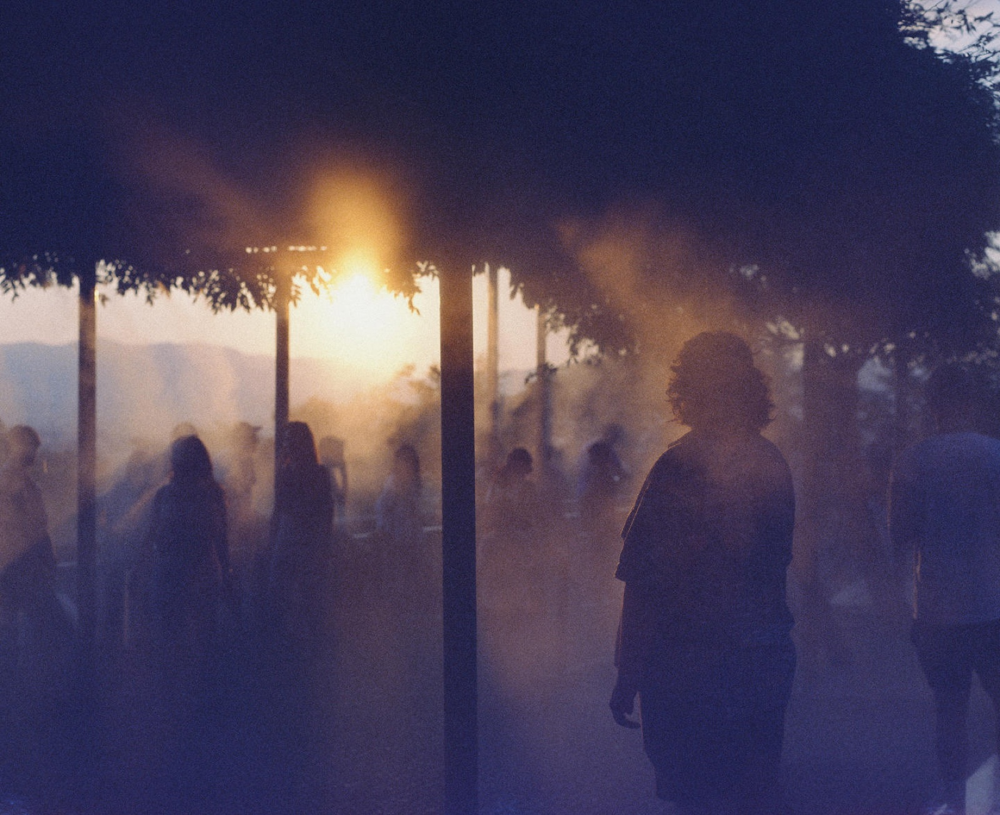
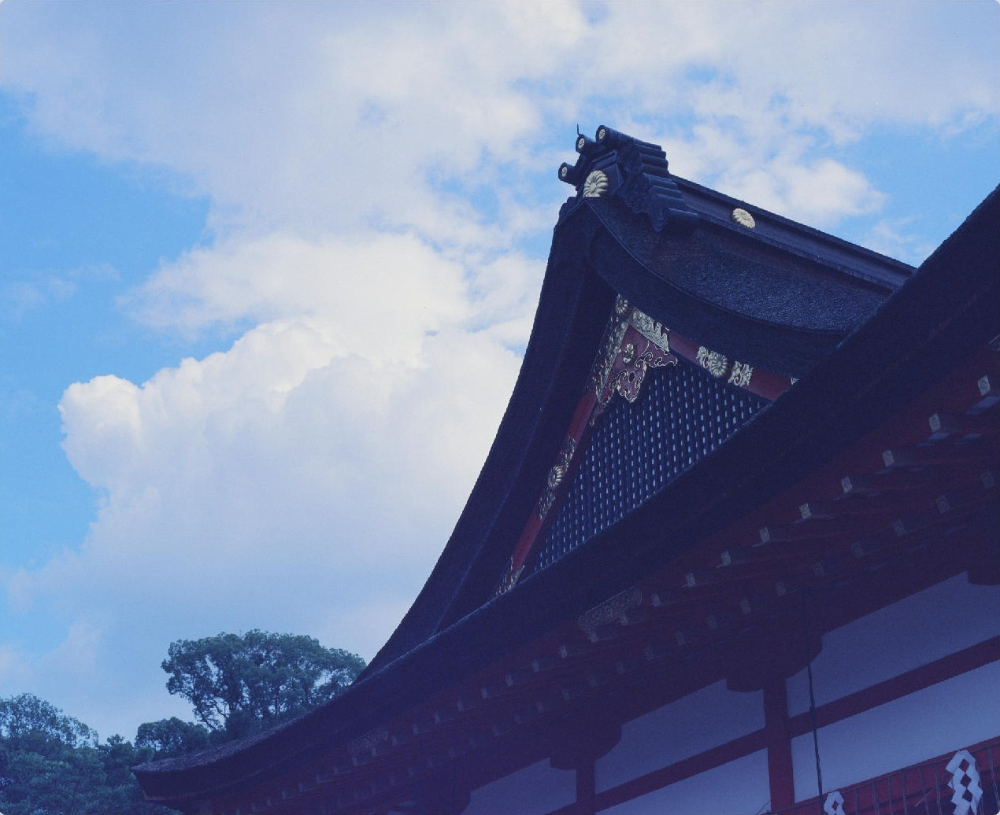
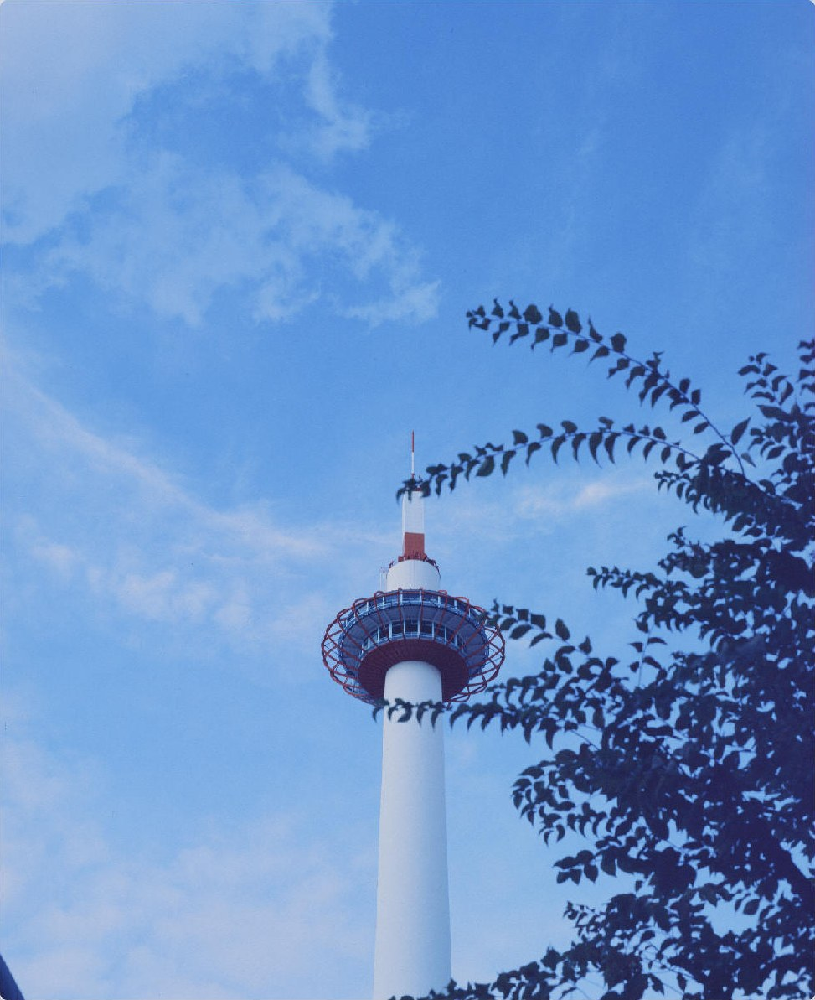
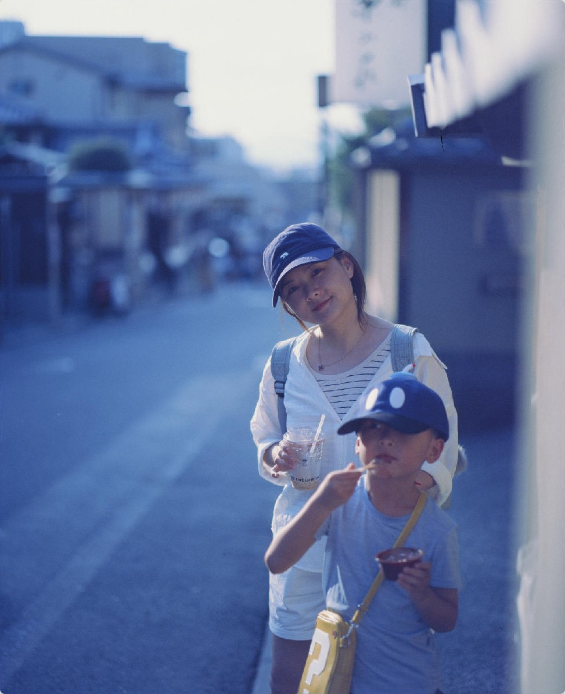
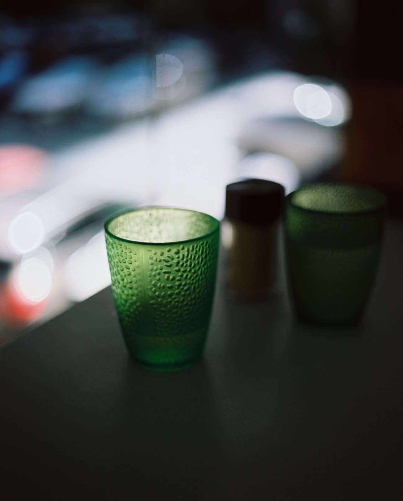
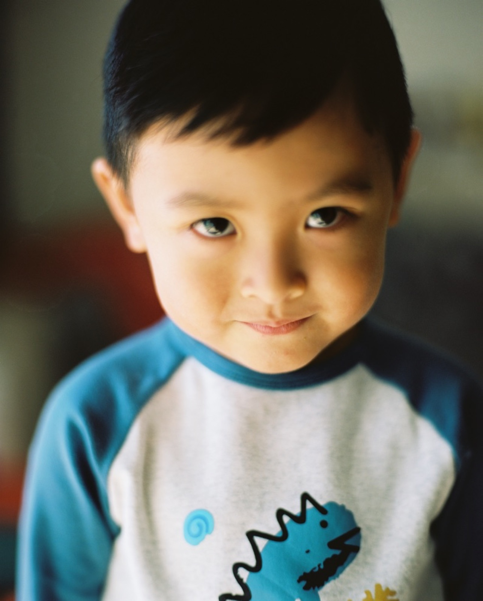

今年 4 月，我在胶片群里说：

> F6 是最漂亮的胶片自动 135 SLR（限定词有点多），宾得 67ii 是最好的中画幅胶片相机。

2024 年底，同一个群里，我说的是「宾得 67 就一言难尽」。那天我刚夸完 6003 方方正正、蛮好带。

两句都是真心话。这几年关于宾得 67 的话散在十几个微信群和私聊里，这次让 Claude 从聊天记录里全部翻了出来，加上我发过的照片，整理成这一篇。



## 入坑

2021 年初我在群里找 645。朋友说要不直接上 67，我回：「哦 我需要自动」「拍不上更废片」。于是先买了一台宾得 645N2。

然后看了后院摄影师畅野的一系列视频，其中一期讲用 p67 拍奔跑的娃。就这么中毒了。后来跟朋友说：「我是看这一系列视频入坑 67 的」「现在还是翻来覆去的看」「基本是我拍照出门拿 67 的很大动力」。

2021 年 8 月，从豪哥手上收了他的 67II。645N2 年底挂上了闲鱼，才拍了十来卷，开价比买入价低了五六百。当时的评价是：「p645 就是干活出片的命，不适合收藏」。到今年我还是那句话：「宾得 645 实在爱不起来」。

入坑的时候儿子已经三岁多了。豪哥问我宾得 67 你抓得住么，我说抓一些安静的时候，「我舍不得快门和胶卷」「所以按的很犹豫很仔细」。

## 为什么稳

2022 年有朋友问我，为什么宾得 67 就特别出片。我的回答分三步：

1. 「单反对焦稳的，双眼和旁轴都有视差」
2. 「宾得自动曝光实现的很好，也是稳得」
3. 「接下来，就是按快门了哈哈」

对焦这一条，我对旁轴一直不放心：「拍人的话就。。我非常怀疑旁轴的对焦精度」「毕竟用惯了 SLR，所见所得，没对上那一定是我手滑了。旁轴啥都看不见，也没有景深效果」。而且单反近摄方便，「我就拿来拍我儿子的大头照」。

曝光这一条，67II 机身带光圈优先，也就是 A 档：我定光圈，相机根据测光自己定快门。当时介绍自己的器材，我写的是：「主力是宾得 67ii，是 67 格式的，特别好用带 A 档，曝光很准，也特大一个。」今年更直接：「67ii 直接无脑 a 档」。

今年 6 月有一次最明显的对比。那次出门 135 和宾得 67 都带了，冲出来是这样：

> 我这次的 135 几乎全毁。。宾得 67 几乎无废片，太稳了。

135 那边是宾得 ME 和 Contax G2，「没几张可以看」。ME 主要赖我，没搞懂它曝光补偿的逻辑。这件事「让我断了继续购入 135 机器的念想」。









## 重，而且累

稳的代价是重。

- 「出片很喜欢，就是太重了，一个月难得出一次门」（2025.01）
- 「昨天p67出门大部份小光圈，但就很重」（2025.09）
- 朋友背着别的机器去英国，我在群里说：「宾得67：我就看你们出去玩呗」

手动对焦也累。「胶片手动已经够费眼神了」「宾得 67 对的太累了」「越是舍不得越不敢按快门」。

还有换卷。120 胶卷在 6×7 画幅上一卷只有 10 张。去年 8 月去印度，只打包了宾得 67：「宾得 67 拍了一会儿就换卷，走的又累，也就拍了 3 卷。」

取景器也小。群里讨论要不要买 RZ67 拍人像，我说：「RZ 真的好。大电视太爽了。宾得 67 尤其是 67ii 取景器太小了。。」



## 换掉，又买回来

后来我把那台 67II 跟人换了一台富士 GF670。

2023 年 6 月，豪哥说他准备出一台 67II。我当时在出差时买了几颗宾得的冷门头，正好缺个机身，在犹豫要不要回宾得家。然后说了实话：

> 跟你收的那台宾得 67 真的是太喜欢了
> 真的好用
> 其他的机器都比不上

豪哥问我干啥卖了。我回：「哎」「跟人换了 gf670」。

2024 年 5 月，我用英文跟一个朋友说：「btw i have got my pentax 67ii back, a big guy.」

后来群里有人问我，670 不香吗？我说：「670 是公主，得供着」「宾得 67 随便草」。

2025 年我开始精简器材，Shenhao 617、Leica M7、Rolleiflex 3.5F、宾得 67 的 90mm 镜头都出掉了，中画幅「快出光了，但是留了一台宾得 67ii 和两台 禄莱 6003」。今年 6 月我在群里说要 all in digital，有人回：你的宾得不同意。我说：

> 宾得 67 不能卖



## 镜头

### 105

我用得最多的是 105mm f/2.4。2021 年刚用的时候跟豪哥说「这颗 105 爱不释手诶」「前几卷 这个 105 的，竟然都对焦对上了，我都觉得好神奇」。

宾得 67 镜头的对焦环手感我也特别喜欢。禄来 600x 系列的镜头都偏紧，宾得 67 系列的 105、90、55 都不错。有朋友说 105 没特色，我不同意：「105 还是挺有特色的呀！」

### ISCO 120mm f/2

这颗是 ISCO 的老镜头，改成了宾得 67 卡口。2025 年 4 月我写过一段出售文案，开头是：

> 非常梦幻的一个镜头，在宾得67上等效58 0.95，一个 Noct 即刻拥有！

这个等效是这么算的。6×7 胶片实际画面约 56×70mm，对角线约 89mm；135 全画幅是 36×24mm，对角线约 43mm。43 ÷ 89 ≈ 0.49，所以 120mm 的视角相当于全画幅上的 120 × 0.49 ≈ 58mm，f/2 的景深相当于 2 × 0.49 ≈ f/0.98。我跟朋友说的简化版本是「宾得 67 差不多系数是 2」「宾得 67 上的 F2，等效不到 F1」。

这颗头我没有加光圈，所以永远是 f/2。国内的改光圈方案（加中置光圈）「说实话都太难看」，我的想法是「这个头买回来就应该全开」，而且「拍人，必须 all in 最大光圈啊」。白天出门光太强，就用宾得 67 自带的滤镜配件，装一片减两档的 ND。朋友问全开会不会糊，我的回答是：「反正分辨率都比不上原装，要的就是那半档一档光圈。」

对焦距离靠两种接环调：宾得 67 原厂微距筒可以对 0.5 到 1 米，拍特写；第三方调焦筒可以对 0.8 到 3 米，日常挂机。

出售文案最后也写了实话：因为还有 105 和 90，出门还是 105 居多，这颗用得少了。但一年多以后，它还在我的机身上。



## 测光顶

67II 的测光在 AE 棱镜取景器里，也就是机身顶上那块。换成腰平取景器，机器轻一些、能低角度拍，但没有测光，A 档也就没了。群里聊到这个，我的原话是：「主要是腰平没测光，难受。」

今年 6 月 9 日，我在群里发了一段：

> 我在想，有没有可能可以逆向工程宾得 67ii 的测光顶？我理解它的工作原理是：机顶测光；在快门被触发的时候，将测光结果返回机身，决定快门速度；机身与机顶是模块化的，他们之间通过一排触点控制。在逆向了解这些触点的协议之后，我们将其接入 iPhone 13mini，让手机完成测光，并将测光结果反映到机身，并在触发的时候，将参数传递到机身。
>
> 如果真的可以搞成，市面上那么多测光顶坏掉的 67ii 就可以复活啦！

当天下午：「颅内编程一天了，YY 了一天。」

这件事我是认真查过的。找到了 67II 的原厂维修手册，从电路图里确认了几件事：

- 机顶和机身之间是 9 个触点：一路 4.0V 电源、一路地，加 7 条信号线。
- 这 7 条线是一组同步串行总线，机身做主机，机顶做从机。
- 机顶里有一颗独立的单片机，负责读 6 块测光元件、光圈和曝光补偿拨盘，把亮度和光圈报给机身；机身再叠加 ISO，算出快门速度。

所以思路是：拿掉真的测光顶，换上腰平取景器看画面；用一块树莓派 Pico 2 接到这 9 个触点上，假装自己是测光顶，把外部测光值（先手动输入，以后换成手机或光传感器）报给机身。这样腰平也能用 A 档。

6 月写完了设计文档和接线草图，状态是「抓包前」：下一步要用逻辑分析仪把真测光顶和机身之间的通信录下来，看清楚每一帧是什么。我仅有的电路知识，还是本科时候的电子设计。

## 照片







用宾得的都是好兄弟。
