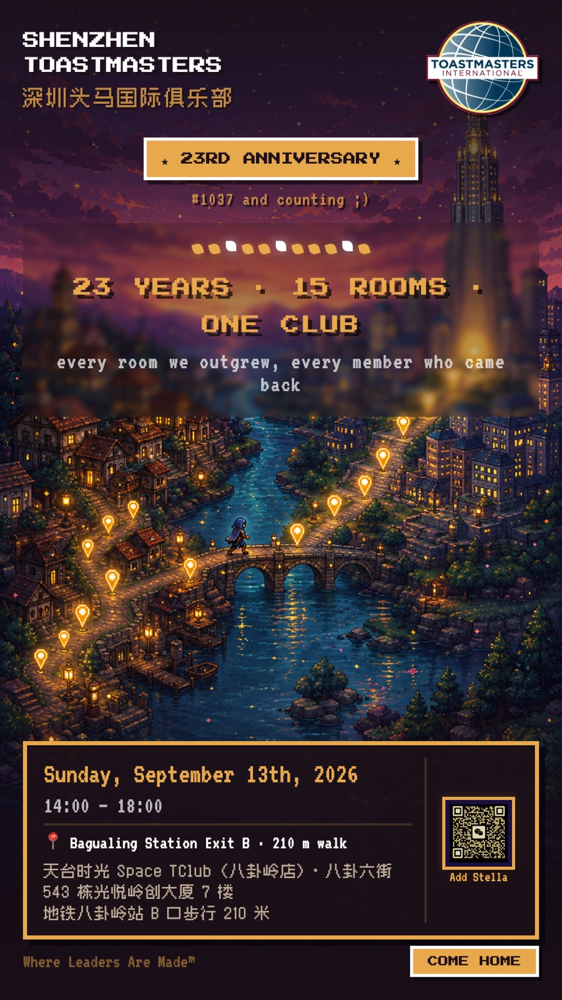

深圳头马（SHENZHEN TOASTMASTERS，SZTM）的特许日期是 2003 年 9 月 8 日，上周刚满 23 岁啦。

为此，我们邀请大家一起来参加我们的生日会，就在 **9 月 13 日（周日）下午 2 点到 6 点**，主题是幼儿园毕业典礼（其实不是哈哈）。

不过为啥提到幼儿园？因为这场的奖项设置是幼儿园那一套：人人有奖，名目怎么不正经怎么来。奖项名单还在收集中，现场公布，来了都有份，谁也别想空手回去。

23 岁的俱乐部，开了 1038 次例会，办一场人人有奖的毕业典礼，挺合适的对不。
请忽略海报中的 1037，因为海报是周日做的，我们周二刚开一场会～

## 节目单

两点开门，正式流程三点才开始。早到的一个小时不会无聊：场地是包下来的，KTV、游戏机、台球、麻将都能用，软饮不限量。

| 时间 | 内容 | 主持人 |
|---|---|---|
| 15:00 | 开场游戏（15 min） | Jason |
| 15:16 | Opening（5 min） | Stella |
| 15:22 | 视频快剪 + SZTM milestone 问答（20 min） | Tao、Camellia |
| 15:43 | 你和 SZTM 的故事（30 min） | Min |
| 16:14 | 互动游戏（20 min） | Mini |
| 16:35 | 切蛋糕 + 颁奖（30 min） | Anna |
| 17:06 | 五年后的 SZTM（10 min） | Rebecca |
| 17:17 | Closing（5 min） | Brownie |
| 17:23 | 会后自由嗨 | 你 |

## 时间地点，记住啦～

- **时间**：2026 年 9 月 13 日（周日）14:00 到 18:00
- **地点**：天台时光 Space TClub（八卦岭店），八卦岭八卦六街 543 栋光悦岭创大厦 7 楼
- **怎么来**：地铁八卦岭站 B 口出来走 210 米

## 人人都要来，免费！

嘉宾欢迎，不需要是会员。想看看头马是什么样子的，这场会跟常规例会很不一样！
名额只有 10 个哦，联系 VPM Stella 报名，海报右下角那个二维码就是她。

老会员更欢迎～ 有几位我们已经单独发过消息了，但是没法照顾到所有老会员，如果你没收到，这条就是喊你回家的！