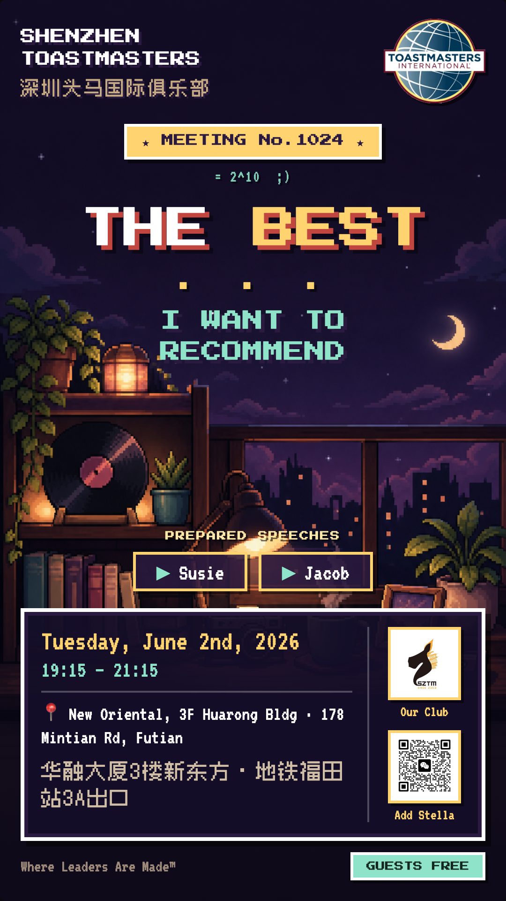

## 让每个 VPPR 头痛的海报

我是 tao，Shenzhen Toastmasters 的 VPPR。这个角色每周有一项固定任务：例会前出一张会议海报，周日截止；之后还要在小红书、取伙、公众号、视频号发会前预告和会后回顾。会议每周开，海报也就每周得做。

以前俱乐部基本都用 Canva。建好一个模板，每周打开，把日期、演讲者、主题换掉，再把元素挪一挪、对齐、导出。这套流程能用，也用了很久，但每周重复同样的动作，做几次就开始烦。鼠标拖来拖去这件事，既谈不上享受，也不一定拖得好看。

海报里其实混着两类工作。一类是判断，比如这期用什么风格、信息怎么排主次、彩蛋埋到什么程度；另一类是实打实的劳动，比如画背景、对齐文字、导出图片。

交给 AI，流程自动化？关键判断得我自己来，其他重复劳动最好是让 AI 来，我自己也不擅长。

动机于是很清楚：把劳动尽量交出去，每周只留下需要我拍板的部分，最好到最后只需要给一个 theme。

我就这么半开玩笑地跟 Claude Code 许了个愿。

## 主架构：ChatGPT 生图 + Claude Code 模板（HTML/CSS 代码化）

对于自动化，我的第一反应是直接用 HTML/CSS 模板，再让 AI 填这周的信息，毕竟写 HTML 是 Claude 最擅长的事情之一。但很快发现这样出图太单一，像 PPT，毫无设计感，纯 HTML/CSS 玩不出花样。

于是策略改成两边分工：ChatGPT 负责画背景图，Claude Code 负责组织模板、把会议信息以 overlay 的方式叠上去。

这里有两点经验。一是背景图要符合海报的特征：得留出适当的空白放文字和 logo，而且要按当期 theme 来生成。二是画图也分活儿。ChatGPT 画氛围感、画面感这类用画笔直接画出来的图很强；但科研示意图、流程图、矢量图这种本质上是文本加标记的东西，反而是 Claude 用工具（比如画 SVG）更靠谱。一句话，搞抽象氛围找 ChatGPT，画结构化的图找 Claude。

这样做省下的不只是排版时间，更重要的是模板里的每个位置都能用文字描述清楚。在 Canva 里得用鼠标拖，在模板里我可以直接说"标题再大两号""logo 加个浅色底""信息框矮一点，别挡背景"。这些改动可复现，也能一点点积累成规范。分工也就定了下来：我负责说清楚要什么，AI 负责把体力活做完。

## 定一个风格，然后锁死它

模板有了，下一个问题是背景风格。我先试了梵高风（用 AI 生成梵高油画质感的背景），最后定在 8-bit 像素风，就是 lo-fi、cozy 那种。

选 8-bit 还有个巧合。这一期正好是 SZTM 的第 1024 期，而 1024 等于 2 的 10 次方，是计算机里最基础的数字之一（1 KB 就是 1024 字节）；像素风又恰好来自早年内存受限的那个年代。

期数和风格对上了，我索性把它定成整个任期的视觉签名，也就是我任期内出的海报都用这个风格。

AI 能生成任何风格，但"这一期为什么用这个风格"得由人来判断，它跟受众有关，也跟当期的意义有关。对我这种不会设计的人来说，锁定一个风格特别重要：定下来之后，每周就不必从零纠结审美，只在同一个底子上换内容、加一点变化，省心很多。

## 让文字长在画面里，而非简单地拼凑

背景越花哨，文字越容易显得是后来硬贴上去的。来回试了几轮之后，我把一些设计判断整理成 AI 能执行的约束。这几条不写代码也用得上，哪怕你还在 Canva 里手动拖：

- 生成背景时先给文字留出干净区域，别让标题和正文压在画面最乱的地方。
- 把会议信息放进一个 8-bit 风格的 RPG 对话框。像素游戏里的文本框本来就是画面的一部分，时间、地点、演讲者放进去就不突兀。
- SZTM 的 logo 是黑色的，直接放在深色背景上会糊，得垫一块浅色底。
- SZTM 是纯英文俱乐部，主信息用英文，中文只做辅助。
- 字要够大够粗。海报多半在手机小屏上看，字一小就等于没写。
- 信息框用两列：左边放时间地点，右边把 logo 和二维码竖排，框尽量矮，别把背景挡死。

这里不涉及什么高深的设计原则或者要上纲上线到 taste，纯粹是来回试、踩了几次坑才摸出来的。每把一条讲清楚，AI 的执行质量就明显好一截：指令太含糊，AI 就瞎做。说"做好看点"没用，说"标题区域留白""logo 要有浅色底"才管用。

## 中文也得像素风格呢！

英文标题我用 Press Start 2P，正文用 VT323，都是现成的像素字体。

麻烦出在中文：一开始中文还是系统黑体，方块汉字和像素英文摆在一起，就非常不搭。索性让 CC 自己去找合适的字体，最后它找到一款开源的中文像素字体 Zpix，中文和英文才像是同一个世界的东西。

中英混排的海报很容易漏掉这一步：英文做得很有风格，中文一露面就穿帮。补上 Zpix，整张图才算统一。

## 一张图，两个版本（小红书说你呢）

发布渠道不止一个，规则也不一样，所以同一张海报得出两版。微信群版保留 VPM 的微信二维码，方便群里扫码报名；小红书版不能放二维码（小红书禁止图片里带二维码），那一块就换成一张写着"私信报名 / DM to Join"的 CTA 瓷片。

平台规则直接决定你能放什么，发布前先把二维码、外链、敏感词这些限制确认清楚，一次多导出一版，比发出去被打回再改省事得多。

## 彩蛋：给海报留个人签名

1024 = 2^10 不是程序员的节日吗，要不索性给每张海报留一个彩蛋？

锁定 8-bit 是给俱乐部本届 PR 把风格统一起来，而彩蛋是我给每张海报留的私人签名。它可以不传达任何报名信息，纯粹是给愿意多看两眼的人准备的。

期数本身就是取之不尽的素材：1025 是质数，1080 可以玩"Full HD"，1111 既是二进制也是光棍节；遇上节日，或者主题里本来就有双关，也能顺手埋一个。

我的想法是，如果以后老会员开始每张海报都先找彩蛋，这件小事反而会成为我这届最有辨识度的东西。

## HTML 到图片自动导出

模板填完还要截图导出，这一步同样烦人。我让 CC 写了个小脚本 `render-poster.sh`，用 Chrome 的 headless 模式把 HTML 直接渲染成 1080×1920 的 PNG，连截图都省了。

用 Agent 的一条大原则：每个要重复的纯机械动作，都值得想办法让它自动跑一次。

## 自动化的最后一步：调用 Codex CLI 直接画图

做到这里，整条流程只剩最后一个手动动作，去网页里粘贴 prompt，生成背景图。

我本以为画图这步躲不掉，总得我自己先在 CC 里生成 prompt，再去 ChatGPT 网页端生图、下载。突然一想，CC 不是可以调用 Codex CLI（OpenAI 的命令行 AI 工具）吗？我记得 Codex 是能画图的，就顺口问了一句，结果 CC 很肯定地回答："Codex 不能生图。"果断不信哈哈，让它去查官方文档，才发现这功能其实早就有了：Codex CLI 内置图像生成，模型是 gpt-image-2，用 imagegen skill 触发，可以从命令行直接驱动，而且算进 ChatGPT 订阅额度，不用单独再付一份 API 的钱。

于是连生成背景图的过程，我们也一并自动化掉了。

## 现在，只剩一个 theme

折腾到现在，我每周的手动动作就两件：

- 从 TTM 拿到 theme，
- 更新有变动的会议信息。

剩下的基本都交给 AI：

- 根据 theme 写一段定制的背景 prompt，
- 调 Codex 用 gpt-image-2 生成像素背景图，
- 套进 HTML 模板（嵌入双 logo、二维码、会议信息和当期彩蛋），
- 最后渲染出微信版和小红书版两张 1080×1920 的 PNG。

视觉签名整个任期都锁在 8-bit，但每期可以在像素底子上叠一层跟 theme 相关的"风味"：梵高式的、童年游戏的致敬，或者《魔戒》这类经典影视的氛围。底子统一，大家一眼就认得出是 SZTM；叠加的风味又让每期不至于雷同。

这周就是现成的例子：第 1024 期，主题 The Best... I Want to Recommend，我给出的就是这句话，文章开头那张海报便是这么来的。

## 最后

从 Canva 时代每周半小时拼图，到现在只给一句话。

但有些东西是不能省的：taste 本身。风格、信息层级、彩蛋分寸、平台规则这些判断，还是得我们自己做主。

如果你也在做 VPPR 或者想要自动化任何流程，我会先建议你把海报/事务拆开看：哪些是必须你拍板的，比如风格、信息主次、彩蛋；哪些只是体力活，比如画图、对齐、导出。后面这一类最适合交给工具，前面那一类别急着丢给 AI，不然海报会很快变得正确但没意思。

再就是给整个任期锁一个视觉签名。选一种风格，所有海报都用它，每期只在同一底子上加一点跟 theme 相关的变化。识别度是靠重复长出来的，而一致性需要有人守着，AI 不会自动替你记住俱乐部的气质。彩蛋也是同一个道理：成本很低，却能慢慢长成你这届的个人标记。

还有，把要求写具体。"给文字留干净区""字够大够粗""logo 加底托""按手机小屏排"，这些话比"做得高级一点"有用得多；平台规则也一样，小红书不能带二维码，就老老实实换成"私信报名"的 CTA，别等发出去被卡住才回头改。

我一直有个愿望，想把 Toastmasters 的数字资产传承下来。这套海报流程就可以这么交接出去：HTML 模板、`render-poster.sh`、字体、彩蛋规范、双版本规则都沉淀成了文件，下一任 VPPR 给个 theme 就能出图。你们不一定用我这套工具，视觉签名完全可以换成你们自己的。

Happy Postering ;)
